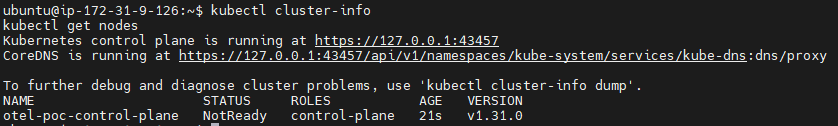
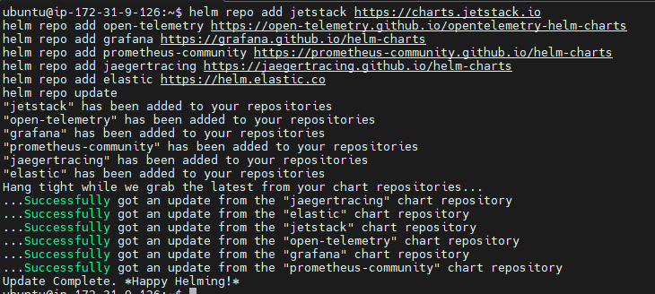
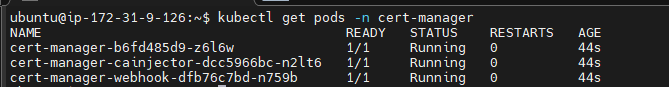
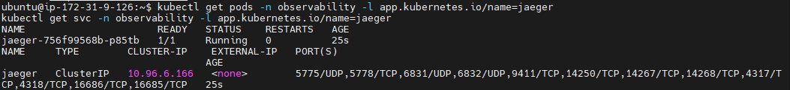
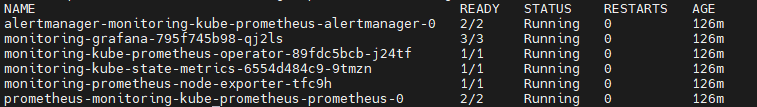
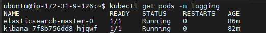
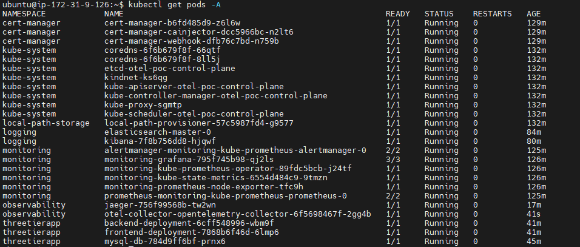
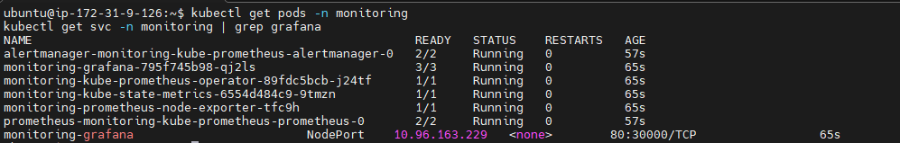
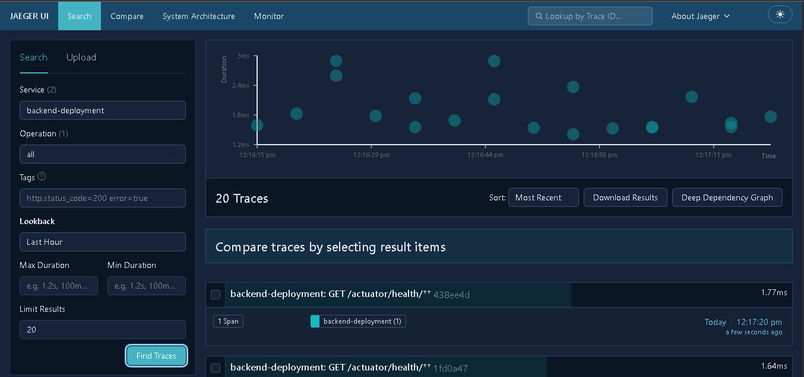
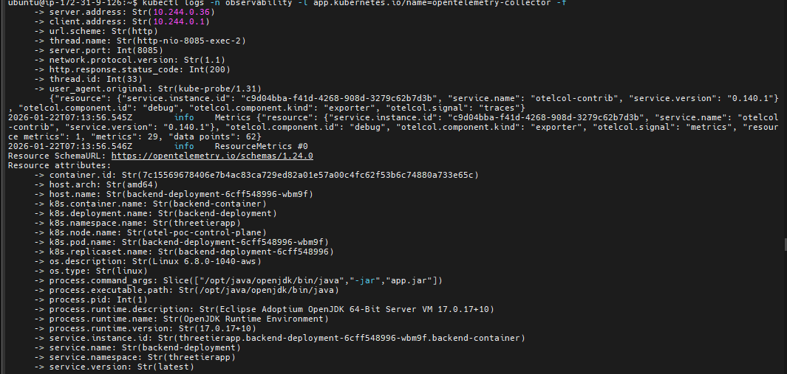

# 🛠️ OpenTelemetry Observability Stack - Complete Production Guide

Complete end-to-end deployment guide for OpenTelemetry with Jaeger, Prometheus, Grafana, and ELK stack in Kubernetes using KIND.


---

## 📊 Architecture Overview

```
┌─────────────────────────────────────────────────────┐
│         Three-Tier Application Pods                 │
│    (Frontend, Backend, MySQL - threetierapp ns)     │
│         Auto-instrumented via OTel Operator         │
└────────────────────┬────────────────────────────────┘
                     │ OTLP (4317 gRPC / 4318 HTTP)
                     ▼
┌─────────────────────────────────────────────────────┐
│        OpenTelemetry Collector                       │
│           (observability namespace)                  │
│  otel-collector-opentelemetry-collector:4318        │
└──────┬───────────────┬──────────────┬───────────────┘
       │               │              │
       │ Traces        │ Metrics      │ Logs
       ▼               ▼              ▼
┌──────────────┐ ┌────────────┐ ┌────────────────┐
│   Jaeger     │ │ Prometheus │ │ Elasticsearch  │
│ :16686 (UI)  │ │  +Grafana  │ │   + Kibana     │
│ :4317 (OTLP) │ │  :3000 (UI)│ │   :5601 (UI)   │
│(observ. ns)  │ │(monitor ns)│ │  (logging ns)  │
└──────────────┘ └────────────┘ └────────────────┘
```

---

## 📋 Prerequisites

### System Requirements

- **OS:** Ubuntu 20.04+ / macOS / Windows (with WSL2)
- **CPU:** 4+ cores recommended
- **RAM:** 8GB minimum, 16GB recommended
- **Disk:** 20GB free space

### Required Tools

| Tool    | Version | Purpose           |
| ------- | ------- | ----------------- |
| Docker  | 24.0+   | Container runtime |
| kubectl | 1.28+   | Kubernetes CLI    |
| Helm    | 3.12+   | Package manager   |
| KIND    | 0.20+   | Local K8s cluster |

---

## 🚀 Installation Guide

### Option A: Verify Existing Tools

```bash
echo "=== Checking Installed Tools ==="
docker --version && echo "✅ Docker installed" || echo "❌ Docker missing"
kubectl version --client --short && echo "✅ kubectl installed" || echo "❌ kubectl missing"
helm version --short && echo "✅ Helm installed" || echo "❌ Helm missing"
kind version && echo "✅ KIND installed" || echo "❌ KIND missing"
```

**Expected Output:**

```
✅ Docker installed
✅ kubectl installed
✅ Helm installed
✅ KIND installed
```

---

### Option B: Fresh Installation (Ubuntu/Debian)

#### Install Docker

```bash
# Update system packages
sudo apt-get update

# Install prerequisites
sudo apt-get install -y \
    ca-certificates \
    curl \
    gnupg \
    lsb-release

# Add Docker's official GPG key
sudo mkdir -p /etc/apt/keyrings
curl -fsSL https://download.docker.com/linux/ubuntu/gpg | \
  sudo gpg --dearmor -o /etc/apt/keyrings/docker.gpg

# Set up Docker repository
echo \
  "deb [arch=$(dpkg --print-architecture) signed-by=/etc/apt/keyrings/docker.gpg] \
  https://download.docker.com/linux/ubuntu \
  $(lsb_release -cs) stable" | \
  sudo tee /etc/apt/sources.list.d/docker.list > /dev/null

# Install Docker Engine
sudo apt-get update
sudo apt-get install -y \
    docker-ce \
    docker-ce-cli \
    containerd.io \
    docker-buildx-plugin \
    docker-compose-plugin

# Add current user to docker group (avoid sudo)
sudo usermod -aG docker $USER
newgrp docker

# Verify installation
docker run hello-world
```

#### Install kubectl

```bash
# Download latest stable kubectl
curl -LO "https://dl.k8s.io/release/$(curl -L -s https://dl.k8s.io/release/stable.txt)/bin/linux/amd64/kubectl"

# Install kubectl
chmod +x kubectl
sudo mv kubectl /usr/local/bin/

# Verify installation
kubectl version --client
```

#### Install Helm

```bash
# Download and install Helm
curl https://raw.githubusercontent.com/helm/helm/main/scripts/get-helm-3 | bash

# Verify installation
helm version
```

#### Install KIND

```bash
# Download KIND binary (v0.24.0)
curl -Lo ./kind https://kind.sigs.k8s.io/dl/v0.24.0/kind-linux-amd64

# Install KIND
chmod +x ./kind
sudo mv ./kind /usr/local/bin/kind

# Verify installation
kind version
```

#### Final Verification

```bash
cat << 'EOF'
╔════════════════════════════════════════╗
║     Installation Verification          ║
╚════════════════════════════════════════╝
EOF

docker --version
kubectl version --client --short
helm version --short
kind version

echo ""
echo "✅ All tools installed successfully!"
```

---

## 🎯 Step-by-Step Deployment

### Step 1: Create KIND Cluster with Port Mappings

```bash
# Create cluster configuration with exposed ports
cat <<EOF | kind create cluster --name otel-poc --config=-
kind: Cluster
apiVersion: kind.x-k8s.io/v1alpha4
nodes:
- role: control-plane
  extraPortMappings:
  # Grafana UI
  - containerPort: 30000
    hostPort: 30000
    protocol: TCP
  # Kibana UI
  - containerPort: 30601
    hostPort: 30601
    protocol: TCP
  # Jaeger UI
  - containerPort: 31686
    hostPort: 31686
    protocol: TCP
  # Application Frontend
  - containerPort: 30001
    hostPort: 30001
    protocol: TCP
EOF
```

**Verify Cluster:**

```bash
# Check cluster info
kubectl cluster-info --context kind-otel-poc

# Verify node is ready
kubectl get nodes

# Expected output:
# NAME                     STATUS   ROLES           AGE   VERSION
# otel-poc-control-plane   Ready    control-plane   1m    v1.27.x
```

<p align="center">
    
</p>

---

### Step 2: Add Helm Repositories

```bash
# Add all required Helm repositories
helm repo add jetstack https://charts.jetstack.io
helm repo add open-telemetry https://open-telemetry.github.io/opentelemetry-helm-charts
helm repo add grafana https://grafana.github.io/helm-charts
helm repo add prometheus-community https://prometheus-community.github.io/helm-charts
helm repo add jaegertracing https://jaegertracing.github.io/helm-charts
helm repo add elastic https://helm.elastic.co

# Update repository cache
helm repo update
```

**Verify Repositories:**

```bash
helm repo list

# Expected output showing all 6 repositories
```

<p align="center">
    
</p>

---

### Step 3: Install Cert-Manager (Required for OTel Operator)

```bash
# Install cert-manager with CRDs
helm install cert-manager jetstack/cert-manager \
  --namespace cert-manager \
  --create-namespace \
  --version v1.16.2 \
  --set crds.enabled=true \
  --wait \
  --timeout 5m
```

**Verify Installation:**

```bash
# Check cert-manager pods
kubectl get pods -n cert-manager

# Expected: 3 pods Running (cert-manager, webhook, cainjector)
```

<p align="center">
    
</p>

---

### Step 4: Deploy Observability Backends

#### 4.1 Deploy Jaeger (Distributed Tracing)

```bash
# Create observability namespace
kubectl create namespace observability

# Deploy Jaeger all-in-one with OTLP support
helm upgrade --install jaeger jaegertracing/jaeger \
  --namespace observability \
  --set allInOne.enabled=true \
  --set collector.enabled=false \
  --set query.enabled=false \
  --set agent.enabled=false \
  --set provisionDataStore.cassandra=false \
  --set storage.type=memory \
  --set allInOne.extraEnv[0].name=COLLECTOR_OTLP_ENABLED \
  --set allInOne.extraEnv[0].value=true \
  --set query.service.type=NodePort \
  --set query.service.nodePort=31686 \
  --wait
```

**Verify Jaeger:**

```bash
# Check Jaeger pods
kubectl get pods -n observability -l app.kubernetes.io/name=jaeger

# Check Jaeger services
kubectl get svc -n observability -l app.kubernetes.io/name=jaeger
```

<p align="center">
    
</p>

---

#### 4.2 Deploy Prometheus + Grafana (Metrics & Visualization)

```bash
# Create monitoring namespace
kubectl create namespace monitoring

# Deploy kube-prometheus-stack
helm upgrade --install monitoring prometheus-community/kube-prometheus-stack \
  --namespace monitoring \
  --set grafana.adminPassword=admin123 \
  --set prometheus.prometheusSpec.serviceMonitorSelectorNilUsesHelmValues=false \
  --set prometheus.prometheusSpec.podMonitorSelectorNilUsesHelmValues=false \
  --set prometheus.prometheusSpec.retention=7d \
  --set grafana.service.type=NodePort \
  --set grafana.service.nodePort=30000 \
  --wait
```

**Verify Monitoring Stack:**

```bash
# Check all monitoring pods
kubectl get pods -n monitoring

# Verify Grafana service
kubectl get svc -n monitoring monitoring-grafana
```

<p align="center">
    
</p>

---

#### 4.3 Deploy Elasticsearch (Log Storage)

```bash
# Create logging namespace
kubectl create namespace logging

# Deploy Elasticsearch with security DISABLED (for dev/PoC)
cat > elasticsearch-direct.yaml <<'EOF'
apiVersion: v1
kind: Service
metadata:
  name: elasticsearch-master
  namespace: logging
  labels:
    app: elasticsearch
spec:
  type: ClusterIP
  ports:
  - port: 9200
    name: http
  - port: 9300
    name: transport
  selector:
    app: elasticsearch
---
apiVersion: apps/v1
kind: StatefulSet
metadata:
  name: elasticsearch-master
  namespace: logging
spec:
  serviceName: elasticsearch-master
  replicas: 1
  selector:
    matchLabels:
      app: elasticsearch
  template:
    metadata:
      labels:
        app: elasticsearch
    spec:
      initContainers:
      - name: fix-permissions
        image: busybox:1.36
        command: ['sh', '-c', 'chown -R 1000:1000 /usr/share/elasticsearch/data']
        volumeMounts:
        - name: data
          mountPath: /usr/share/elasticsearch/data
      - name: increase-vm-max-map
        image: busybox:1.36
        command: ['sysctl', '-w', 'vm.max_map_count=262144']
        securityContext:
          privileged: true
      containers:
      - name: elasticsearch
        image: docker.elastic.co/elasticsearch/elasticsearch:8.11.0
        ports:
        - containerPort: 9200
          name: http
        - containerPort: 9300
          name: transport
        env:
        - name: discovery.type
          value: "single-node"
        - name: ES_JAVA_OPTS
          value: "-Xms1g -Xmx1g"
        - name: xpack.security.enabled
          value: "false"
        - name: xpack.security.enrollment.enabled
          value: "false"
        - name: xpack.security.http.ssl.enabled
          value: "false"
        - name: xpack.security.transport.ssl.enabled
          value: "false"
        - name: cluster.name
          value: "elasticsearch"
        - name: node.name
          valueFrom:
            fieldRef:
              fieldPath: metadata.name
        resources:
          requests:
            cpu: 500m
            memory: 2Gi
          limits:
            cpu: 1000m
            memory: 2Gi
        volumeMounts:
        - name: data
          mountPath: /usr/share/elasticsearch/data
        readinessProbe:
          httpGet:
            path: /_cluster/health?local=true
            port: 9200
            scheme: HTTP
          initialDelaySeconds: 60
          periodSeconds: 10
  volumeClaimTemplates:
  - metadata:
      name: data
    spec:
      accessModes: ["ReadWriteOnce"]
      resources:
        requests:
          storage: 10Gi
EOF

# Apply Elasticsearch configuration
kubectl apply -f elasticsearch-direct.yaml

# Wait for Elasticsearch to be ready
kubectl wait --for=condition=ready pod -l app=elasticsearch \
  -n logging --timeout=300s
```

**Test Elasticsearch:**

```bash
# Test connection
kubectl run test-es --image=curlimages/curl -i --rm --restart=Never -n logging -- \
  curl -s http://elasticsearch-master:9200

# Expected output: JSON with cluster info
```

---

#### 4.4 Deploy Kibana (Log Visualization)

```bash
# Create Kibana deployment
cat > kibana-deploy.yaml <<'EOF'
apiVersion: apps/v1
kind: Deployment
metadata:
  name: kibana
  namespace: logging
  labels:
    app: kibana
spec:
  replicas: 1
  selector:
    matchLabels:
      app: kibana
  template:
    metadata:
      labels:
        app: kibana
    spec:
      containers:
      - name: kibana
        image: docker.elastic.co/kibana/kibana:8.11.0
        env:
        - name: ELASTICSEARCH_HOSTS
          value: "http://elasticsearch-master.logging.svc.cluster.local:9200"
        - name: SERVER_HOST
          value: "0.0.0.0"
        - name: ELASTICSEARCH_SSL_VERIFICATIONMODE
          value: "none"
        - name: XPACK_SECURITY_ENABLED
          value: "false"
        - name: XPACK_ENCRYPTEDSAVEDOBJECTS_ENCRYPTIONKEY
          value: "min-32-byte-long-strong-encryption-key-value"
        ports:
        - containerPort: 5601
          name: http
        resources:
          requests:
            cpu: 200m
            memory: 1Gi
          limits:
            cpu: 1000m
            memory: 2Gi
        readinessProbe:
          httpGet:
            path: /api/status
            port: 5601
          initialDelaySeconds: 90
          periodSeconds: 10
          timeoutSeconds: 10
          failureThreshold: 20
---
apiVersion: v1
kind: Service
metadata:
  name: kibana
  namespace: logging
  labels:
    app: kibana
spec:
  type: NodePort
  ports:
  - port: 5601
    targetPort: 5601
    nodePort: 30601
    protocol: TCP
    name: http
  selector:
    app: kibana
EOF

# Deploy Kibana
kubectl apply -f kibana-deploy.yaml
```

**Verify Kibana:**

```bash
# Watch Kibana pod startup
kubectl get pods -n logging -l app=kibana -w

# Check logs (should show successful startup)
kubectl logs -n logging -l app=kibana --tail=20
```

<p align="center">
    
</p>

---

### Step 5: Deploy OpenTelemetry Components

#### 5.1 Install OpenTelemetry Operator

```bash
# Install OTel Operator
helm install opentelemetry-operator open-telemetry/opentelemetry-operator \
  --namespace observability \
  --set manager.collectorImage.repository=otel/opentelemetry-collector-contrib \
  --set manager.collectorImage.tag=0.140.0 \
  --wait
```

**Verify Operator:**

```bash
kubectl get pods -n observability -l app.kubernetes.io/name=opentelemetry-operator
```

---

#### 5.2 Create Auto-Instrumentation Configuration

```bash
# Create instrumentation resource for auto-instrumentation
cat > instrumentation.yaml <<'EOF'
apiVersion: opentelemetry.io/v1alpha1
kind: Instrumentation
metadata:
  name: otel-autoinstrumentation
  namespace: observability
spec:
  propagators:
    - tracecontext
    - baggage

  sampler:
    type: parentbased_traceidratio
    argument: "1.0"

  exporter:
    endpoint: http://otel-collector-opentelemetry-collector.observability.svc.cluster.local:4318

  java:
    image: ghcr.io/open-telemetry/opentelemetry-operator/autoinstrumentation-java:latest
    env:
      - name: OTEL_EXPORTER_OTLP_PROTOCOL
        value: "http/protobuf"
      - name: OTEL_TRACES_EXPORTER
        value: "otlp"
      - name: OTEL_METRICS_EXPORTER
        value: "otlp"
      - name: OTEL_LOGS_EXPORTER
        value: "otlp"

  nodejs:
    image: ghcr.io/open-telemetry/opentelemetry-operator/autoinstrumentation-nodejs:latest
    env:
      - name: OTEL_EXPORTER_OTLP_PROTOCOL
        value: "http/protobuf"
      - name: OTEL_TRACES_EXPORTER
        value: "otlp"
      - name: OTEL_METRICS_EXPORTER
        value: "otlp"
      - name: OTEL_LOGS_EXPORTER
        value: "otlp"

  python:
    image: ghcr.io/open-telemetry/opentelemetry-operator/autoinstrumentation-python:latest
    env:
      - name: OTEL_EXPORTER_OTLP_PROTOCOL
        value: "http/protobuf"
      - name: OTEL_TRACES_EXPORTER
        value: "otlp"
      - name: OTEL_METRICS_EXPORTER
        value: "otlp"
      - name: OTEL_LOGS_EXPORTER
        value: "otlp"
EOF

# Apply instrumentation configuration
kubectl apply -f instrumentation.yaml
```

---

#### 5.3 Deploy OpenTelemetry Collector

```bash
# Create collector configuration
cat > collector-values.yaml <<'EOF'
mode: deployment

image:
  repository: otel/opentelemetry-collector-contrib
  tag: 0.140.0
  pullPolicy: IfNotPresent

presets:
  kubernetesAttributes:
    enabled: true

service:
  type: ClusterIP
  ports:
    otlp-grpc:
      enabled: true
      containerPort: 4317
      servicePort: 4317
      protocol: TCP
    otlp-http:
      enabled: true
      containerPort: 4318
      servicePort: 4318
      protocol: TCP
    metrics:
      enabled: true
      containerPort: 8888
      servicePort: 8888
      protocol: TCP

resources:
  requests:
    cpu: 300m
    memory: 512Mi
  limits:
    cpu: 1000m
    memory: 1Gi

config:
  extensions:
    health_check:
      endpoint: ":13133"
    pprof:
      endpoint: ":1777"
    zpages:
      endpoint: ":55679"

  receivers:
    otlp:
      protocols:
        grpc:
          endpoint: 0.0.0.0:4317
        http:
          endpoint: 0.0.0.0:4318

    prometheus:
      config:
        scrape_configs:
          - job_name: "otel-collector"
            scrape_interval: 30s
            static_configs:
              - targets: ["0.0.0.0:8888"]

  processors:
    memory_limiter:
      check_interval: 5s
      limit_percentage: 75
      spike_limit_percentage: 25

    batch:
      send_batch_size: 1024
      timeout: 10s

    k8sattributes:
      auth_type: serviceAccount
      passthrough: false

    resource:
      attributes:
        - key: deployment.environment
          value: dev
          action: insert

  exporters:
    debug:
      verbosity: detailed
      sampling_initial: 5
      sampling_thereafter: 200

    otlp/jaeger:
      endpoint: jaeger-collector.observability.svc.cluster.local:4317
      tls:
        insecure: true

    prometheus:
      endpoint: 0.0.0.0:8888
      resource_to_telemetry_conversion:
        enabled: true

    elasticsearch:
      endpoints:
        - http://elasticsearch-master.logging.svc.cluster.local:9200
      logs_index: otel-logs
      tls:
        insecure_skip_verify: true

  service:
    extensions: [health_check, pprof, zpages]

    telemetry:
      logs:
        level: info
      metrics:
        address: 0.0.0.0:8889

    pipelines:
      traces:
        receivers: [otlp]
        processors: [memory_limiter, k8sattributes, resource, batch]
        exporters: [debug, otlp/jaeger]

      metrics:
        receivers: [otlp, prometheus]
        processors: [memory_limiter, k8sattributes, resource, batch]
        exporters: [prometheus, debug]

      logs:
        receivers: [otlp]
        processors: [memory_limiter, k8sattributes, resource, batch]
        exporters: [debug, elasticsearch]
EOF

# Deploy OpenTelemetry Collector
helm upgrade --install otel-collector open-telemetry/opentelemetry-collector \
  -n observability \
  -f collector-values.yaml \
  --wait
```

**Verify Collector:**

```bash
# Check collector pod
kubectl get pods -n observability -l app.kubernetes.io/name=opentelemetry-collector

# View collector logs
kubectl logs -n observability -l app.kubernetes.io/name=opentelemetry-collector --tail=50
```

---

### Step 6: Deploy Three-Tier Application

#### 6.1 Deploy Application Components

```bash
# Create application namespace
kubectl create namespace threetierapp

# Deploy secrets and ConfigMaps
kubectl apply -f K8s/secrets-configmap.yml -n threetierapp

# Deploy MySQL database
kubectl apply -f K8s/mysql-ds.yml -n threetierapp

# Deploy backend service
kubectl apply -f K8s/backend-ds.yml -n threetierapp

# Deploy frontend service
kubectl apply -f K8s/frontend-ds.yml -n threetierapp
```

#### 6.2 Enable Auto-Instrumentation

```bash
# Patch backend deployment for Java auto-instrumentation
kubectl patch deployment backend-deployment -n threetierapp --patch '{
  "spec": {
    "template": {
      "metadata": {
        "annotations": {
          "instrumentation.opentelemetry.io/inject-java": "observability/otel-autoinstrumentation"
        }
      }
    }
  }
}'

# Patch frontend deployment for Node.js auto-instrumentation
kubectl patch deployment frontend-deployment -n threetierapp --patch '{
  "spec": {
    "template": {
      "metadata": {
        "annotations": {
          "instrumentation.opentelemetry.io/inject-nodejs": "observability/otel-autoinstrumentation"
        }
      }
    }
  }
}'
```

**Verify Application:**

```bash
# Check all application pods
kubectl get pods -n threetierapp

# Expected: 3 pods Running (mysql, backend, frontend)
```

<p align="center">
    
</p>

---

## 🌐 Access UIs & Dashboards

### Grafana (Metrics Visualization)

```bash
# Access via NodePort
# URL: http://localhost:30000

# Or use port-forward
kubectl port-forward svc/monitoring-grafana -n monitoring 3000:80
# URL: http://localhost:3000
```

**Credentials:**

- **Username:** `admin`
- **Password:** `admin123`

<p align="center">
    
</p>

---

### Jaeger (Distributed Tracing)

```bash
# Access via NodePort
# URL: http://localhost:31686

# Or use port-forward
kubectl port-forward svc/jaeger-query -n observability 16686:16686
# URL: http://localhost:16686
```

<p align="center">
    
</p>

---

### Kibana (Log Analytics)

```bash
# Access via NodePort
# URL: http://localhost:30601

# Or use port-forward
kubectl port-forward svc/kibana -n logging 5601:5601
# URL: http://localhost:5601
```

**Configure Index Pattern:**

1. Navigate to **Stack Management** → **Index Patterns**
2. Create pattern: `otel-logs*`
3. Select timestamp field: `@timestamp`
4. View logs in **Discover** tab

<p align="center">
    
</p>

<p align="center">
    
</p>

---

## ✅ Verification & Testing

### Test 1: Verify All Pods Running

```bash
# Check all namespaces
kubectl get pods --all-namespaces

# Check specific namespaces
kubectl get all -n observability
kubectl get all -n monitoring
kubectl get all -n logging
kubectl get all -n threetierapp
```

**Expected:** All pods in `Running` status

---

### Test 2: Test Service Discovery

```bash
# Test Jaeger OTLP endpoint
kubectl run test-jaeger --image=curlimages/curl -i --rm --restart=Never -n observability -- \
  curl -v http://jaeger-collector:4318

# Test Elasticsearch
kubectl run test-es --image=curlimages/curl -i --rm --restart=Never -n logging -- \
  curl -s http://elasticsearch-master:9200

# Test Prometheus
kubectl run test-prom --image=curlimages/curl -i --rm --restart=Never -n monitoring -- \
  curl -s http://monitoring-prometheus:9090/-/healthy
```

---

### Test 3: Send Test Trace

```bash
# Send test OTLP trace to collector
kubectl run test-otlp --image=curlimages/curl -i --rm --restart=Never -n observability -- \
  curl -X POST http://otel-collector-opentelemetry-collector:4318/v1/traces \
  -H "Content-Type: application/json" \
  -d '{
    "resourceSpans": [{
      "resource": {
        "attributes": [{
          "key": "service.name",
          "value": {"stringValue": "test-service"}
        }]
      },
      "scopeSpans": [{
        "scope": {"name": "manual-test"},
        "spans": [{
          "traceId": "5B8EFFF798038103D269B633813FC60C",
          "spanId": "EEE19B7EC3C1B174",
          "name": "test-span",
          "kind": 1,
          "startTimeUnixNano": "1544712660000000000",
          "endTimeUnixNano": "1544712661000000000"
        }]
      }]
    }]
  }'
```

**Verify in Jaeger:**

1. Open Jaeger UI at http://localhost:31686
2. Select service: `test-service`
3. Click **Find Traces**
4. You should see the test trace

---

### Test 4: Monitor Collector Logs

```bash
# Stream collector logs
kubectl logs -n observability -l app.kubernetes.io/name=opentelemetry-collector -f
```

**Expected log entries:**

```
info	TracesExporter	{"kind": "exporter", "#spans": 1}
info	MetricsExporter	{"kind": "exporter", "#datapoints": X}
info	LogsExporter	{"kind": "exporter", "#records": X}
```

---

## 🐛 Troubleshooting Guide

### Issue 1: Kibana Shows "Elasticsearch Connection Error"

**Symptoms:**

- Kibana UI shows connection error
- Kibana logs show "received plaintext http traffic on https channel"

**Solution:**

```bash
# Check Elasticsearch security settings
kubectl logs -n logging elasticsearch-master-0 | grep "security"

# If security is enabled, redeploy Elasticsearch with security disabled
kubectl delete statefulset elasticsearch-master -n logging
kubectl apply -f elasticsearch-direct.yaml
```

---

### Issue 2: Jaeger Not Receiving Traces

**Symptoms:**

- No traces visible in Jaeger UI
- Collector shows connection errors to Jaeger

**Solution:**

```bash
# Verify Jaeger collector service exists
kubectl get svc jaeger-collector -n observability

# Check if OTLP port 4317 is exposed
kubectl describe svc jaeger-collector -n observability | grep 4317

# If missing, redeploy Jaeger with OTLP enabled
helm upgrade --install jaeger jaegertracing/jaeger \
  --namespace observability \
  --set allInOne.extraEnv[0].name=COLLECTOR_OTLP_ENABLED \
  --set allInOne.extraEnv[0].value=true
```

---

### Issue 3: OTel Collector CrashLooping

**Symptoms:**

- Collector pod in `CrashLoopBackOff` state
- Pod restarts continuously

**Solution:**

```bash
# Check collector logs for errors
kubectl logs -n observability -l app.kubernetes.io/name=opentelemetry-collector

# Common fixes:
# 1. Invalid exporter endpoint - verify service names
# 2. Memory limit too low - increase to 1Gi
# 3. Invalid YAML - validate collector-values.yaml

# Redeploy with corrected configuration
helm upgrade --install otel-collector open-telemetry/opentelemetry-collector \
  -n observability \
  -f collector-values.yaml \
  --wait
```

---

### Issue 4: Application Pods Not Auto-Instrumented

**Symptoms:**

- No telemetry data from application
- Pods don't show OTel init containers

**Solution:**

```bash
# Verify instrumentation resource exists
kubectl get instrumentation -n observability

# Check pod annotations
kubectl describe pod <pod-name> -n threetierapp | grep instrumentation

# Re-apply patches
kubectl patch deployment backend-deployment -n threetierapp --patch '{
  "spec": {
    "template": {
      "metadata": {
        "annotations": {
          "instrumentation.opentelemetry.io/inject-java": "observability/otel-autoinstrumentation"
        }
      }
    }
  }
}'
```

---

## 🧹 Cleanup & Uninstallation

### Quick Cleanup (Delete Everything)

```bash
# Delete all Helm releases
helm delete otel-collector opentelemetry-operator jaeger -n observability
helm delete monitoring -n monitoring
helm delete cert-manager -n cert-manager

# Delete Kubernetes resources
kubectl delete -f kibana-deploy.yaml
kubectl delete -f elasticsearch-direct.yaml

# Delete application
kubectl delete namespace threetierapp

# Delete infrastructure namespaces
kubectl delete namespace observability monitoring logging cert-manager

# Delete KIND cluster
kind delete cluster --name otel-poc
```

### Selective Cleanup (Keep Cluster)

```bash
# Delete only application
kubectl delete namespace threetierapp

# Delete only observability stack
helm delete otel-collector opentelemetry-operator jaeger -n observability
kubectl delete namespace observability

# Delete only monitoring stack
helm delete monitoring -n monitoring
kubectl delete namespace monitoring

# Delete only logging stack
kubectl delete -f kibana-deploy.yaml
kubectl delete -f elasticsearch-direct.yaml
kubectl delete namespace logging
```

---

## 🎯 Success Checklist

Use this checklist to verify successful deployment:

- [ ] **Cluster:** KIND cluster created and accessible
- [ ] **Cert-Manager:** 3 pods running in cert-manager namespace
- [ ] **Jaeger:** Jaeger pod running, UI accessible at port 31686
- [ ] **Prometheus/Grafana:** All monitoring pods running, Grafana at port 30000
- [ ] **Elasticsearch:** Pod running and responding to health checks
- [ ] **Kibana:** Pod running, UI accessible at port 30601, connected to Elasticsearch
- [ ] **OTel Operator:** Operator pod running in observability namespace
- [ ] **OTel Collector:** Collector pod running, accepting OTLP on ports 4317/4318
- [ ] **Application:** All 3 application pods running in threetierapp namespace
- [ ] **Auto-Instrumentation:** Application pods show OTel init containers
- [ ] **Traces:** Test trace visible in Jaeger UI
- [ ] **Metrics:** Prometheus scraping metrics from collector
- [ ] **Logs:** Logs flowing to Elasticsearch and visible in Kibana

---

## 📚 Project Structure

```
.
├── K8s/                          # Kubernetes manifests
│   ├── secrets-configmap.yml    # Application secrets
│   ├── mysql-ds.yml             # MySQL deployment
│   ├── backend-ds.yml           # Backend deployment
│   └── frontend-ds.yml          # Frontend deployment
├── frontend/                     # Frontend application code
├── backend/                      # Backend application code
├── snapshots/                    # Documentation screenshots
└── README.md                     # This file
```

---


